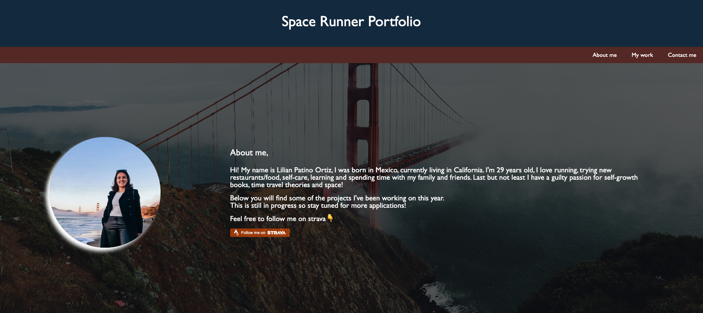
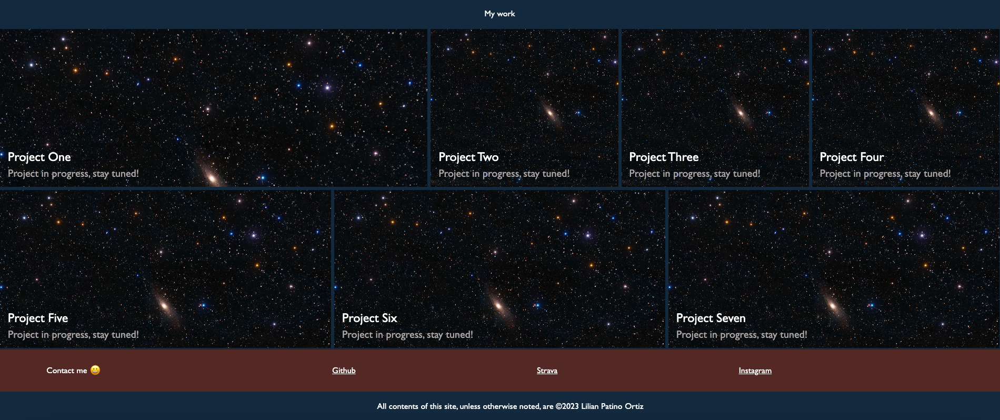

# Space Rnner Portfolio

### ~ Advanced-CSS-Challenge 😎

## Description

This project was a great start for showing my personal portfolio, which I can use on my resume in the future when being contacted by recruiters!
The advantage of having a portfolio is that I can show some personal applications and the process behind them... and Its available 24/7.
My plan is to eventually add this site to a personal domain and update it regulartly with the projects I develop outside my full-time job.

## Table of Contents (Optional)

If your README is long, add a table of contents to make it easy for users to find what they need.

- [Installation](#installation)
- [Usage](#usage)
- [Credits](#credits)
- [License](#license)

## Installation

To run the project in your local machine:

1. Open visual studio in your computer or laptop
2. Clone the git project: https://github.com/lilianpatinoortiz/Space-Runner-Portfolio
3. Pull the latest from the 'main' branch
4. Locate the index.html file
5. Right click on the file and select "Open in default browser"
6. A new window on your default browser should open with the web page containing the prework study guide

Access the deployed project here: https://lilianpatinoortiz.github.io/Space-Runner-Portfolio/

## Usage

After running the project you will be able to access my portfolio! Since I don't have any personal projects right now, all of them are listed as "project in progress".
Stay tuned to see the updates on my site 😄
Click on the upper right nav menu to navigate to the different sections of my portfolio, and click oin each project (in the future) to access each one of the applications I've developed.
Looking forward to see you back here!

## Credits

The main resources used:

- Bootcamp canvas - Module 02
- Strava icon & css from their official page

## License

Please refer to the LICENSE in the repo.
